## Features available in the program

1. Inbox: each user has an inbox to save the coming emails 
2. Trash folder to hold the deleted email 
3. Composite
4. Drafts: in case the user write the message and didn't send it 
5. Filters: so, the user can filter his mails according to specific values 
6. Searching: the user can find any email contains the word he searches for 
7. Sort: the user can sort his emails according to specific values 
8. Send and receive attachments: the user can send any type of attachments

## How to use program

In our program, the user must sign up in our site to be able to use our program If the user already has an account so he should sign in to be able to send and receive his incoming cmails. 
Send e-mails: after clicking on "composite", there is a white blank paper that appear to write whatever you want to send. Delete incoming e-mails: there is a trash button, after clicking on it, the message will be saved in file called "delete" 
All your outcoming e-mails are saved in file called "sent" in case you want to take a look in it again. There is a file called "draft": the code will save all the unsended mails in it In case the user wants to order his cmails, there is an "order" button to make it easy to order them. In case the user wants to filter his cmails, there is a "filter" button to make it easy to order them. The search section, it is for searching for contacts, cmails and words. There is an "attachment" button, the user can select any number of attachments to send. 

## Snapshots
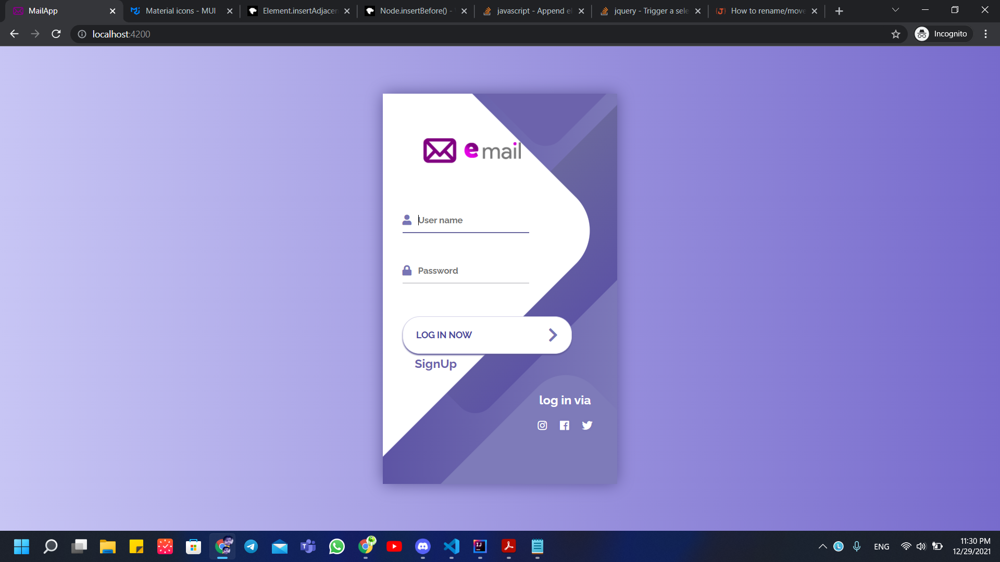

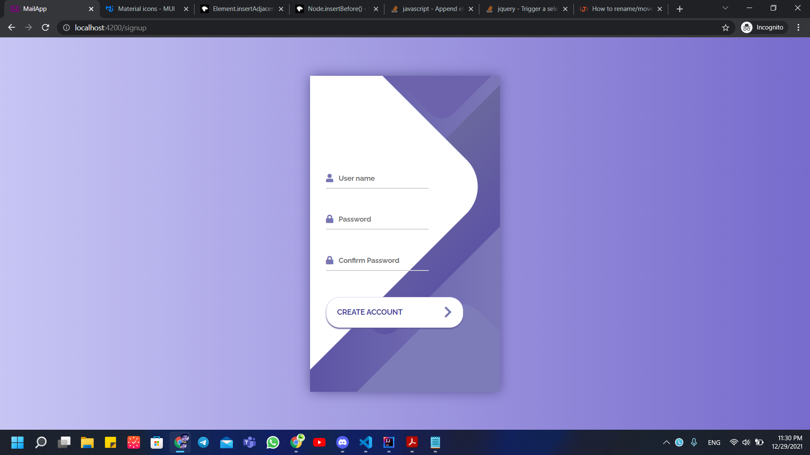

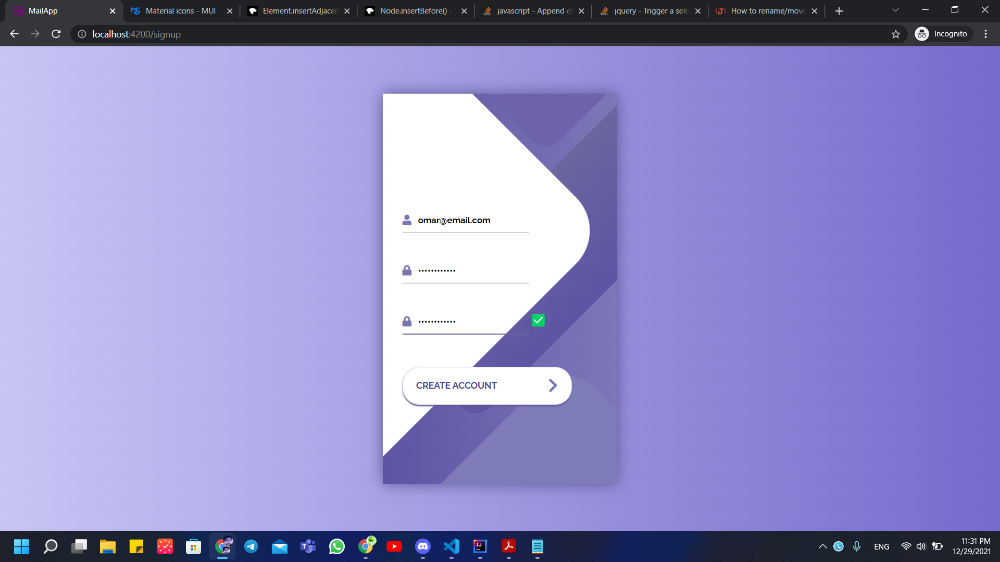

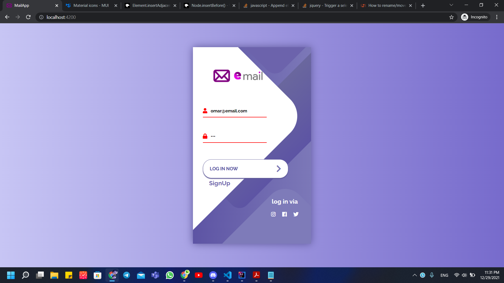

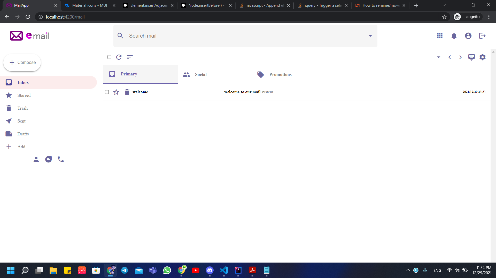

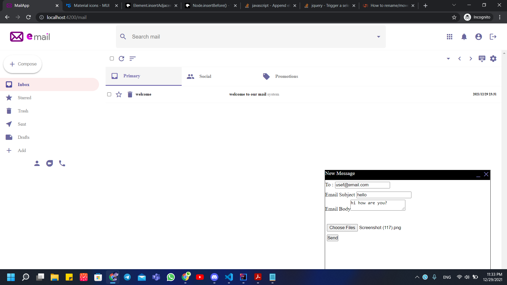

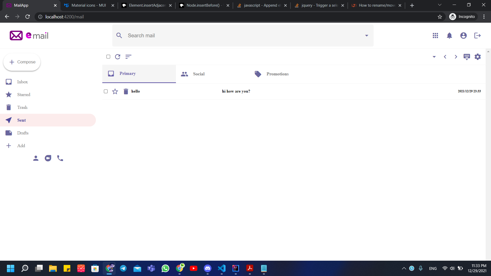

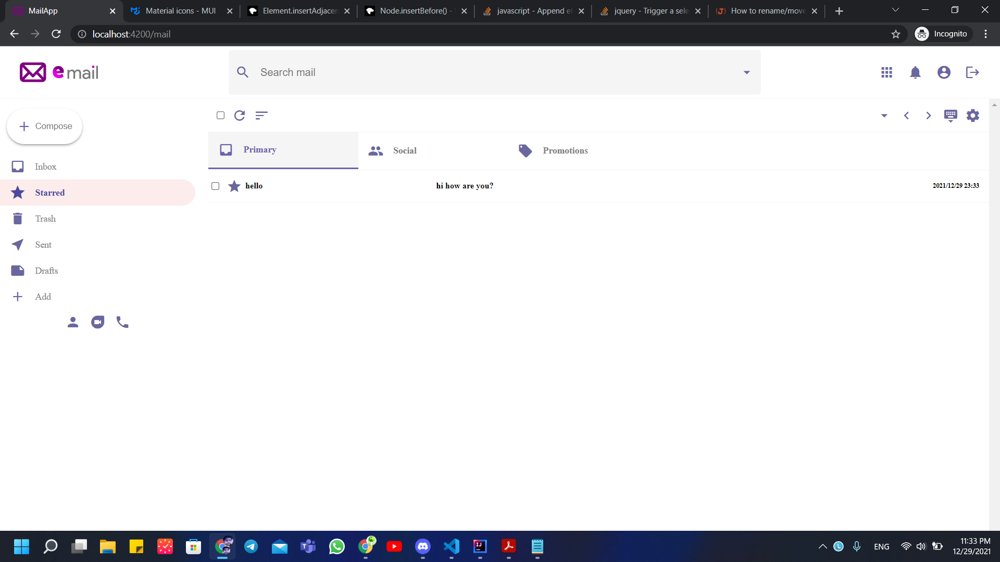

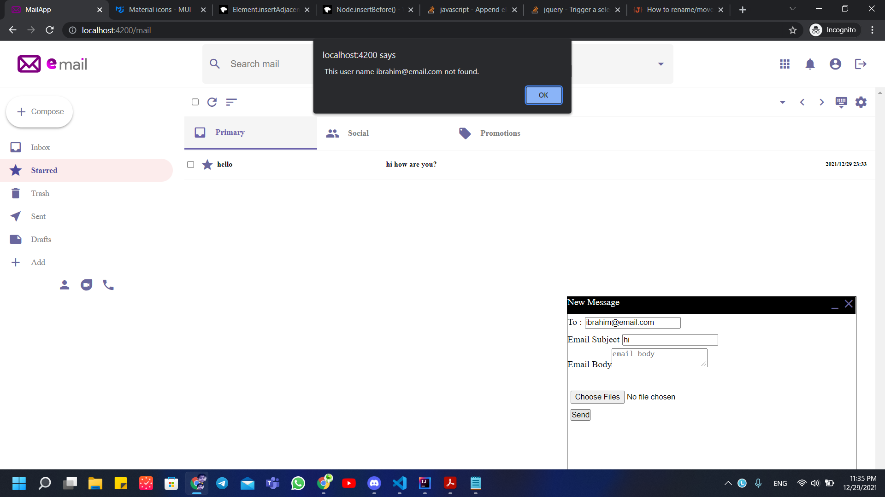

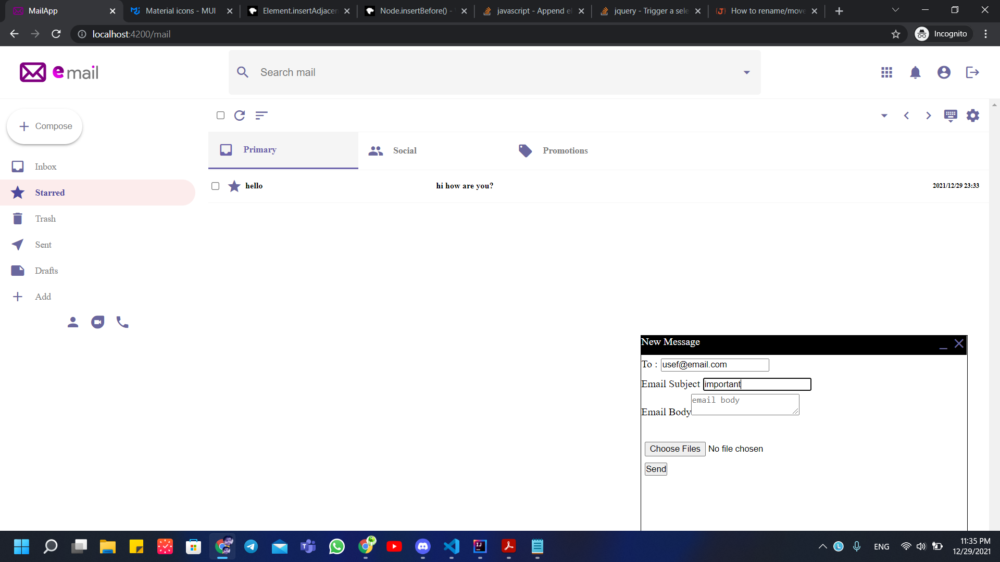

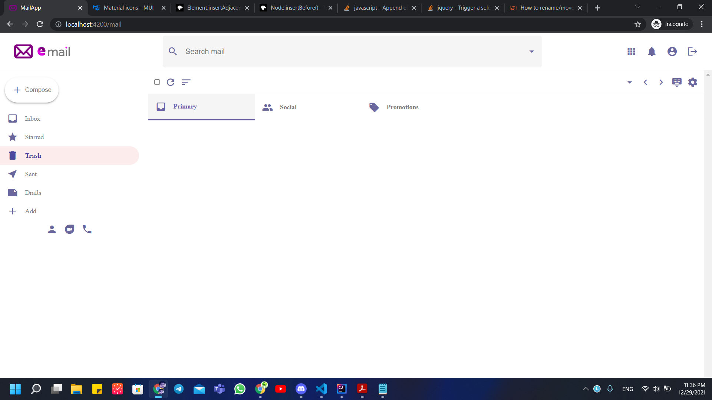

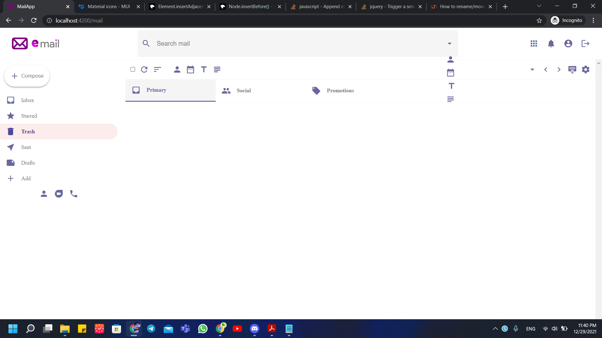
